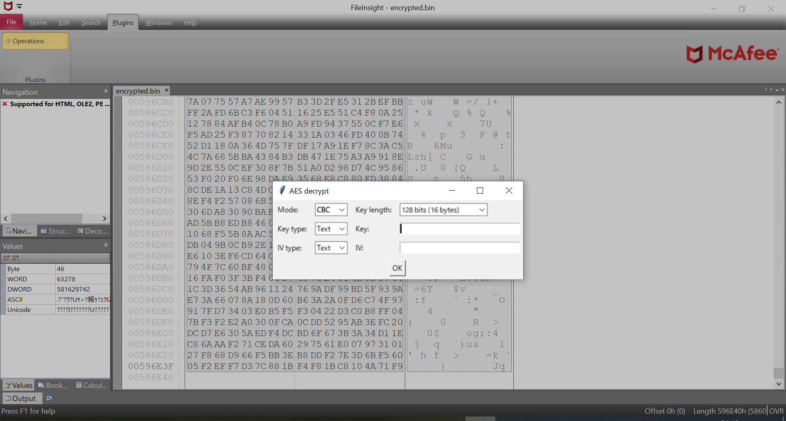
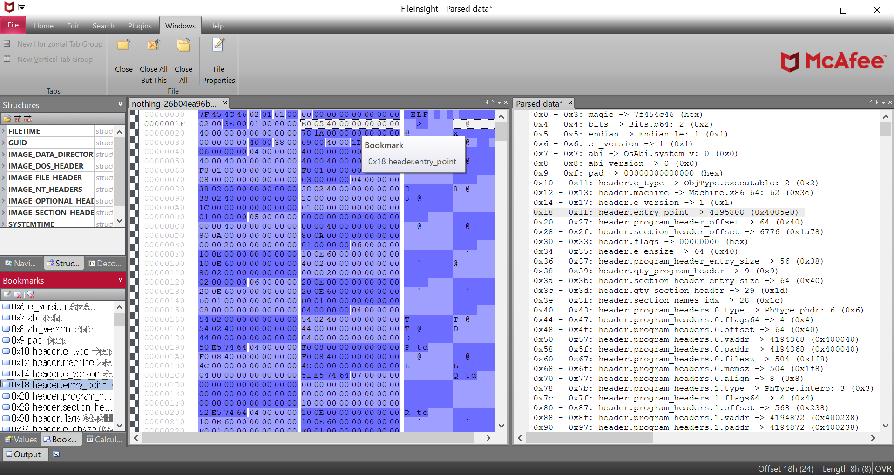
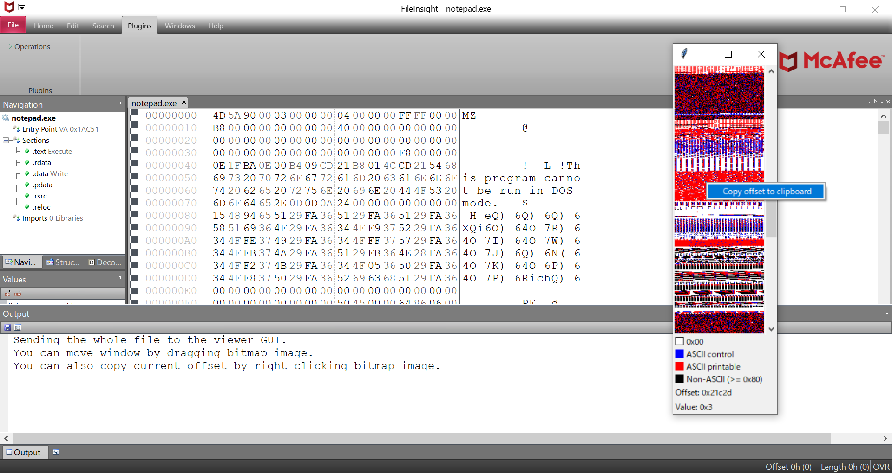
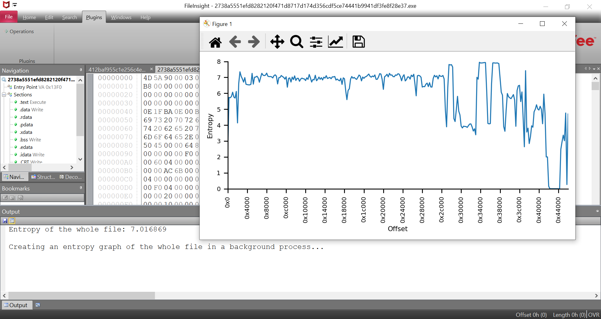
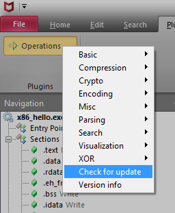
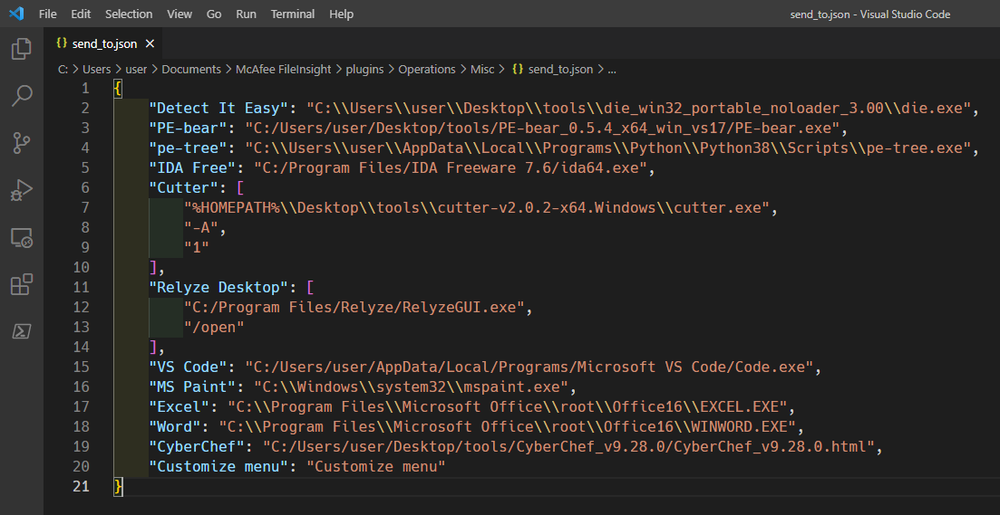

[](https://www.blackhat.com/us-21/arsenal/schedule/#fileinsight-plugins-decoding-toolbox-of-mcafee-fileinsight-hex-editor-for-malware-analysis-23386)

# FileInsight-plugins: McAfee FileInsight バイナリエディタのマルウェア解析用デコードツールボックス

FileInsight-plugins は McAfee FileInsight バイナリエディタ用のプラグイン集です。
暗号の復号、圧縮の展開、XOR された文字列の検索、YARA ルールでのスキャン、コードのエミュレーション、逆アセンブル等、多数の機能を追加できます。
マルウェア解析に関する様々なデコード作業に便利です。（例：文書ファイル型のマルウェアからマルウェアの実行ファイルやダミーの文書ファイルを抽出する）

## スクリーンショット
#### AES decrypt プラグインのダイアログ


#### YARA scan プラグインの実行結果


#### Parse file structure プラグインで ELF ファイルの構造をパースした結果


#### Emulate code プラグインで ARM64 の Linux 用のシェルコードをエミュレートした結果


#### Disassemble プラグインで x86 の Linux 用のシェルコードを逆アセンブルした結果


#### Bitmap view プラグインで Windows の実行ファイルを可視化した結果


#### Byte histogram プラグインで表示した Excel ファイル中の値の出現頻度のグラフ


#### Entropy graph プラグインで表示した Windows の実行ファイルのエントロピーのグラフ


## 講演
### Black Hat USA 2021 Arsenal
* [概要 (Black Hat USA ウェブサイト)](https://www.blackhat.com/us-21/arsenal/schedule/#fileinsight-plugins-decoding-toolbox-of-mcafee-fileinsight-hex-editor-for-malware-analysis-23386)
* [スライド](https://raw.githubusercontent.com/nmantani/FileInsight-plugins/master/docs/FileInsight-plugins-Black%20Hat%20USA%202021%20Arsenal.pdf)

### CODE BLUE 2019 Bluebox
* [概要 (CODE BLUE ウェブサイト)](https://codeblue.jp/2019/en/bluebox/FileInsight-plugins/)
* [スライド (英語)](https://raw.githubusercontent.com/nmantani/FileInsight-plugins/master/docs/FileInsight-plugins-CODE%20BLUE%202019.pdf)
* [スライド (日本語)](https://raw.githubusercontent.com/nmantani/FileInsight-plugins/master/docs/FileInsight-plugins-CODE%20BLUE%202019-ja.pdf)

## 使用例
* [Use case 1: executable file embedded in Excel file](https://github.com/nmantani/FileInsight-plugins/wiki/Use-case-1--executable-file-embedded-in-Excel-file)
* [Use case 2: executable file embedded in RTF file](https://github.com/nmantani/FileInsight-plugins/wiki/Use-case-2--executable-file-embedded-in-RTF-file)
* [Use case 3: obfuscated PHP webshell](https://github.com/nmantani/FileInsight-plugins/wiki/Use-case-3--obfuscated-PHP-webshell)
* [Use case 4: YARA rule testing](https://github.com/nmantani/FileInsight-plugins/wiki/Use-case-4--YARA-rule-testing)
* [Use case 5: Code emulation](https://github.com/nmantani/FileInsight-plugins/wiki/Use-case-5--Code-emulation)

## インストール方法
### 自動でのインストール
以下のコマンドを実行してください。最新のリリース版の FileInsight-plugins と FileInsight、Python 3.9.x (x64) を含む全ての必要なものがインストールされます。

```
powershell -exec bypass -command "IEX((New-Object Net.WebClient).DownloadString('https://raw.githubusercontent.com/nmantani/FileInsight-plugins/master/install.ps1'))"
```

プロキシサーバを使用している場合は (例えば IPアドレス: 10.0.0.1 ポート番号: 8080) 以下のコマンドを実行してください。

```
curl -x http://10.0.0.1:8080 -Lo install.ps1 https://raw.githubusercontent.com/nmantani/FileInsight-plugins/master/install.ps1
powershell -exec bypass .\install.ps1
```

## 手動でのインストール
詳しくは [INSTALL.ja.md](INSTALL.ja.md) をお読みください。
手動でのインストールは多数の手順が必要となりますので、**自動でのインストールを強くおすすめします。**

## 使い方
Plugins タブにある "Operations" をクリックして、プラグインを選択してください。


右クリックのメニューからプラグインを使用することもできます。


いくつかのプラグインは使用時に設定のダイアログを表示します。


## アップデート方法
### 半自動でのアップデート
FileInsight-plugins を最新のリリース版にアップデートしたい場合はプラグインのメニューの
Check for update をクリックしてください。新しいバージョンがある場合はインストール用の
PowerShell スクリプト(https://raw.githubusercontent.com/nmantani/FileInsight-plugins/master/install.ps1)
が実行されます。既存のファイルは上書きされます。



以下のコマンドを実行してアップデートすることもできます(Check for update メニューはこのコマンドを実行しています)。

```
powershell -exec bypass -command "& ([scriptblock]::Create((New-Object Net.WebClient).DownloadString('https://raw.githubusercontent.com/nmantani/FileInsight-plugins/master/install.ps1'))) -update"
```

HTTP プロキシをお使いの場合は install.ps1 をダウンロードして、ファイル中の $PROXY_HOST と
$PROXY_PORT の変数を編集してから以下のコマンドを実行してください

```
powershell -exec bypass .\install.ps1 -update
```

FileInsight-plugins を最新のスナップショットに更新したい場合は "-snapshot" オプションを追加してください。

```
powershell -exec bypass -command "& ([scriptblock]::Create((New-Object Net.WebClient).DownloadString('https://raw.githubusercontent.com/nmantani/FileInsight-plugins/master/install.ps1'))) -update -snapshot"
```

### 手動でのアップデート
最新のリリース版をダウンロードして plugins フォルダを %USERPROFILE%\Documents\McAfee FileInsight
に上書きコピーしてください。

## カスタマイズ
Send to (CLI) プラグインと Send to (GUI) プラグインはファイルをあなたのお好みのプログラムで開くことができます。
Send to プラグインのメニューで Customize menu をクリックしてください。


"plugins\Operations\Misc\send_to_cli.json" (Send to (CLI) プラグイン) または"plugins\Operations\Misc\send_to.json" (Send to (GUI) プラグイン) がデフォルトのテキストエディタで開かれます。編集して保存してください。



カスタマイズした内容がメニューに反映されます。


## プラグインの一覧 (122個)
### Basic operations
* Copy to new file  
  選択範囲を(選択していない場合は全体を)新しいファイルとして開きます。
* Bookmark  
  選択範囲を指定したコメントと色でブックマークします。
* Cut binary to clipboard  
  選択範囲のバイナリデータをクリップボードに切り取ります(16進テキストとして)。
* Copy binary to clipboard  
  選択範囲のバイナリデータをクリップボードにコピーします(16進テキストとして)。
* Paste binary from clipboard  
  クリップボードからバイナリデータをペーストします(16進テキストから変換)。
  Paste binary data (converted from hex-encoded text) from clipboard
* Delete before  
  現在のカーソル位置より前を全て削除します。
* Delete after  
  現在のカーソル位置より後を全て削除します。
* Fill  
  選択範囲を指定した16進数のパターンで埋めます。
* Invert  
  選択範囲のビットを反転します。
* Reverse order  
  選択範囲のバイト列の順序を逆に並べ替えます。
* Change endianness  
  選択範囲のエンディアンを変換します。
* Swap nibbles  
  選択範囲内のニブルの組を入れ替えます。
* Swap two bytes  
  選択範囲内のバイトの組を入れ替えます。
* To upper case  
  選択範囲内の小文字を大文字にします。
* To lower case  
  選択範囲内の大文字を小文字にします。
* Swap case  
  選択範囲内の大文字と小文字を入れ替えます。

### Compression operations
#### Compress
* aPLib  
  選択範囲を aPLib 圧縮ライブラリで圧縮します。
* Bzip2  
  選択範囲を bzip2 アルゴリズムで圧縮します。
* Gzip  
  選択範囲を gzip 形式で圧縮します。
* LZ4  
  選択範囲を LZ4 アルゴリズムで圧縮します。
* LZF  
  選択範囲を LZF アルゴリズムで圧縮します。
* LZMA  
  選択範囲を LZMA アルゴリズムで圧縮します。
* LZNT1  
  選択範囲を LZNT1 アルゴリズムで圧縮します。
* LZO  
  選択範囲を LZO アルゴリズムで圧縮します。
* LZRW1/KH  
  選択範囲を LZRW1/KH アルゴリズムで圧縮します。
* PPMd  
  選択範囲を PPMd アルゴリズムで圧縮します。
* QuickLZ  
  選択範囲を QuickLZ 圧縮ライブラリで圧縮します。
* Raw deflate  
  選択範囲をヘッダとチェックサムを付けずに Deflate アルゴリズムで圧縮します。(PHP言語の gzdeflate() と同等)
* XZ  
  選択範囲を XZ 形式で圧縮します。
* zlib (deflate)  
  選択範囲を zlib (Deflate アルゴリズム) で圧縮します。
* Zstandard  
  選択範囲を Zstandard アルゴリズムで圧縮します。

#### Decompress
* aPLib  
  選択範囲を aPLib 圧縮ライブラリで展開します。
* Bzip2  
  選択範囲を bzip2 アルゴリズムで展開します。
* Gzip  
  gzip 形式で圧縮された選択範囲を展開します。
* LZ4  
  選択範囲を LZ4 アルゴリズムで展開します。
* LZF  
  選択範囲を LZF アルゴリズムで展開します。
* LZMA  
  選択範囲を LZMA アルゴリズムで展開します。
* LZNT1  
  選択範囲を LZNT1 アルゴリズムで展開します。
* LZO  
  選択範囲を LZO アルゴリズムで展開します。
* LZRW1/KH  
  選択範囲を LZRW1/KH アルゴリズムで展開します。
* PPMd  
  選択範囲を PPMd アルゴリズムで展開します。
* QuickLZ  
  選択範囲を QuickLZ 圧縮ライブラリで展開します。
* Raw inflate  
  ヘッダとチェックサムを付けずに Deflate 圧縮された選択範囲を展開します。(PHP言語の gzinflate() と同等)
* XZ  
  選択範囲を XZ 形式として展開します。
* zlib (inflate)  
  選択範囲を zlib (Deflate アルゴリズム) で展開します。
* Zstandard  
  選択範囲を Zstandard アルゴリズムで展開します。

### Crypto operations
#### Decrypt
* AES  
  選択範囲を AES で復号します。
* ARC2  
  選択範囲を ARC2 (Alleged RC2) で復号します。
* ARC4  
  選択範囲を ARC4 (Alleged RC4) で復号します。
* Blowfish  
  選択範囲を Blowfish で復号します。
* ChaCha20  
  選択範囲を ChaCha20 で復号します。
* DES  
  選択範囲を DES で復号します。
* Salsa20  
  選択範囲を Salsa20 で復号します。
* TEA  
  選択範囲を TEA (Tiny Encryption Algorithm) で復号します。
* Triple DES  
  選択範囲を Triple DES で復号します。
* XTEA  
  選択範囲を XTEA (eXtended Tiny Encryption Algorithm) で復号します。

#### Encrypt
* AES  
  選択範囲を AES で暗号化します。
* ARC2  
  選択範囲を ARC2 (Alleged RC2) で暗号化します。
* ARC4  
  選択範囲を ARC4 (Alleged RC4) で暗号化します。
* Blowfish  
  選択範囲を Blowfish で暗号化します。
* ChaCha20  
  選択範囲を ChaCha20 で暗号化します。
* DES  
  選択範囲を DES で暗号化します。
* Salsa20  
  選択範囲を Salsa20 で暗号化します。
* TEA  
  選択範囲を TEA (Tiny Encryption Algorithm) で暗号化します。
* Triple DES  
  選択範囲を Triple DES で暗号化します。
* XTEA  
  選択範囲を XTEA (eXtended Tiny Encryption Algorithm) で暗号化します。

### Encoding operations
#### Decode
* Hex text to binary data  
  選択範囲の16進数のテキストをバイナリデータに変換します。
* Decimal text to binary data  
  選択範囲の10進数のテキストをバイナリデータに変換します。
* Octal text to binary data  
  選択範囲の8進数のテキストをバイナリデータに変換します。
* Binary text to binary data  
  選択範囲の2進数のテキストをバイナリデータに変換します。
* Custom base16 decode  
  選択範囲をカスタムbase16テーブルを使ってデコードします。
* Custom base32 decode  
  選択範囲をカスタムbase32テーブルを使ってデコードします。
* Custom base58 decode  
  選択範囲をカスタムbase58テーブルを使ってデコードします。
* Custom base64 decode  
  選択範囲をカスタムbase64テーブルを使ってデコードします。
* Custom base85 decode  
  選択範囲をカスタムbase85テーブルを使ってデコードします。
* Protobuf decode  
  選択範囲を Protocol Buffers でシリアライズされたデータとして .proto ファイル無しでデコードします。
* From quoted printable  
  選択範囲を quoted printable としてデコードします。
* Unicode unescape  
  選択範囲の Unicode エスケープシーケンスを文字列に戻します。
* URL decode  
  選択範囲を URL に使われているパーセントでエンコードされたテキストとしてデコードします。

#### Encode
* Binary data to hex text  
  選択範囲のバイナリデータを16進数のテキストに変換します。
* Binary data to decimal text  
  選択範囲のバイナリデータを10進数のテキストに変換します。
* Binary data to octal text  
  選択範囲のバイナリデータを8進数のテキストに変換します。
* Binary data to binary text  
  選択範囲のバイナリデータを2進数のテキストに変換します。
* Custom base16 encode  
  選択範囲をカスタムbase16テーブルを使ってエンコードします。
* Custom base32 encode  
  選択範囲をカスタムbase32テーブルを使ってエンコードします。
* Custom base58 encode  
  選択範囲をカスタムbase58テーブルを使ってエンコードします。
* Custom base64 encode  
  選択範囲をカスタムbase64テーブルを使ってエンコードします。
* Custom base85 encode  
  選択範囲をカスタムbase85テーブルを使ってエンコードします。
* ROT13  
  選択範囲のアルファベットの文字列を指定した数だけローテートします。(デフォルト: 13)
* To quoted printable  
  選択範囲を quoted printable としてエンコードします。
* Unicode escape  
  選択範囲の Unicode 文字列をエスケープします。
* URL encode  
  選択範囲を URL に使われているパーセントでエンコードされたテキストとしてエンコードします。

### Misc operations
* Emulate code  
  選択範囲を(選択していない場合は全体を) Qiling Framework でエミュレートします。
* File comparison  
  2つのファイルの内容を比較します。
* Hash values  
  選択範囲の(選択していない場合は全体の) MD5, SHA1, SHA256, ssdeep, imphash, impfuzzy ハッシュ値を計算します。
* Send to (CLI)  
  選択範囲を(選択していない場合は全体を)別の CLI プログラムで開いて結果を取得します。
* Send to (GUI)  
  選択範囲を(選択していない場合は全体を)別の GUI プログラムで開きます。

### Parsing operations
* Binwalk scan  
  選択範囲を(選択していない場合は全体を)スキャンして埋め込まれたファイルを探します。
* Disassemble  
  選択範囲を(選択していない場合は全体を)逆アセンブルします。
* File type  
  選択範囲の(選択していない場合は全体の)ファイルの種類を判別します。
* Find PE file  
  選択範囲から(選択していない場合は全体から) PE ヘッダ情報に基づいて PE ファイルを探します。
* Parse file structure  
  選択範囲を(選択していない場合は全体を) のファイル構造を Kaitai Struct でパースします。  
  対応フォーマット: Gzip, RAR, ZIP, ELF, Mach-O, PE, MBR パーティションテーブル, BMP, GIF, JPEG, PNG, Windows ショートカット
* Show metadata  
  選択範囲の(選択していない場合は全体の)ファイルのメタデータを ExifTool を使って表示します。
* Strings  
  選択範囲から(選択していない場合は全体から)文字列を抽出します。

### Search operations
* Regex extraction  
  選択範囲から(選択していない場合は全体から) 正規表現で検索してマッチした領域を1つに連結された領域として抽出します。
* Regex search  
  選択範囲から(選択していない場合は全体から) 正規表現で検索してマッチした領域をブックマークします。
* Replace  
  選択範囲から(選択していない場合は全体から) 正規表現で検索してマッチした領域を指定したデータで置換します。
* XOR hex search  
  選択範囲から(選択していない場合は全体から) XOR またはビットローテートされているバイト列を検索します。
* XOR text search  
  選択範囲から(選択していない場合は全体から) XOR またはビットローテートされている文字列を検索します。
* YARA scan  
  選択範囲を(選択していない場合は全体を) YARA でスキャンします。

### Visualization operations
* Bitmap view  
  ファイル全体をビットマップとして可視化します。
* Byte histogram  
  選択範囲の(選択していない場合は全体の)値の出現頻度のグラフを出力します。
* Entropy graph  
  選択範囲の(選択していない場合は全体の)エントロピーのグラフを出力します。

### XOR operations
* Decremental XOR  
  選択範囲を XOR キーの値を減らしながら XOR します。
* Incremental XOR  
  選択範囲を XOR キーの値を増やしながら XOR します。
* Null-preserving XOR  
  選択範囲をヌルバイトと XOR キー自体をスキップしながら XOR します。
* XOR with another file  
  選択範囲を別のファイルの内容をキーにして XOR します。
* XOR with next byte  
  選択範囲を次のバイトを XOR のキーにしながら XOR します。
* XOR with next byte (reverse)  
  "XOR with next byte" プラグインの逆の操作を行います。
* Guess multibyte XOR keys  
  0x00 と XOR することによって現れているキーの値に基づいて選択範囲から(選択していない場合は全体から)複数バイトの XOR キーを推測します。
* Visual encrypt  
  選択範囲をマルウェアの Zeus で使われている visual encrypt アルゴリズムでエンコードします。
* Visual decrypt  
  選択範囲をマルウェアの Zeus で使われている visual decrypt アルゴリズムでデコードします。

## 作者
萬谷 暢崇 (Twitter: @nmantani)

## ライセンス
The BSD 2-Clause License (http://opensource.org/licenses/bsd-license.php)
