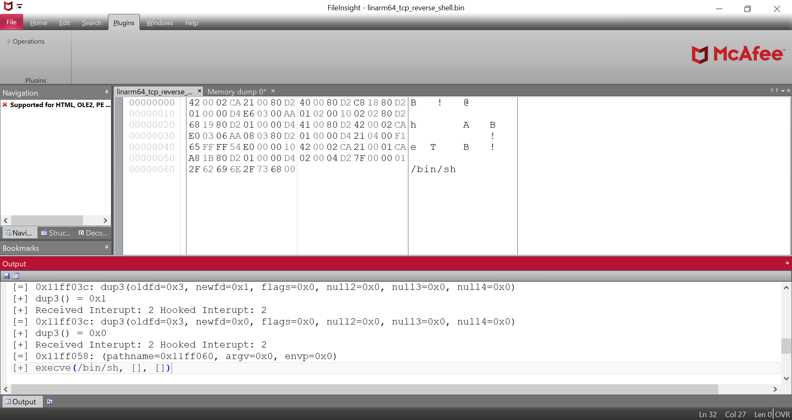
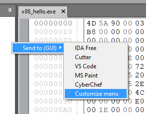
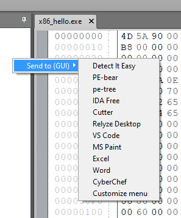

[](https://www.blackhat.com/us-21/arsenal/schedule/#fileinsight-plugins-decoding-toolbox-of-mcafee-fileinsight-hex-editor-for-malware-analysis-23386)

# FileInsight-plugins: decoding toolbox of McAfee FileInsight hex editor for malware analysis

FileInsight-plugins is a large set of plugins for McAfee FileInsight hex editor.
It adds many capabilities such as decryption, decompression, searching XOR-ed text strings, scanning with a YARA rule, code emulation, disassembly, and more!
It is useful for various kinds of decoding tasks in malware analysis (e.g. extracting malware executables and decoy documents from malicious document files).

## Screenshots
#### Dialog of "AES decrypt" plugin


#### Scan result of "YARA scan" plugin


#### Data structure of ELF executable file parsed by "Parse file structure" plugin


#### Emulation trace of ARM64 Linux shellcode emulated by "Emulate code" plugin


#### Disassembly output of x86 Linux shellcode disassembled by "Disassemble" plugin


#### Bitmap representation of Windows executable file visualized by "Bitmap view" plugin


#### Byte histogram of Excel file shown by "Byte histogram" plugin


#### Entropy graph of Windows executable file shown by "Entropy graph" plugin


## Presentations
### Black Hat USA 2021 Arsenal
* [Abstract at Black Hat USA website](https://www.blackhat.com/us-21/arsenal/schedule/#fileinsight-plugins-decoding-toolbox-of-mcafee-fileinsight-hex-editor-for-malware-analysis-23386)
* [Slide deck](https://raw.githubusercontent.com/nmantani/FileInsight-plugins/master/docs/FileInsight-plugins-Black%20Hat%20USA%202021%20Arsenal.pdf)
* [Demo movie](https://www.youtube.com/watch?v=nGDLnoiv9Xs)

### CODE BLUE 2019 Bluebox
* [Abstract at CODE BLUE website](https://codeblue.jp/2019/en/bluebox/FileInsight-plugins/)
* [Slide deck (English)](https://raw.githubusercontent.com/nmantani/FileInsight-plugins/master/docs/FileInsight-plugins-CODE%20BLUE%202019.pdf)
* [Slide deck (Japanese)](https://raw.githubusercontent.com/nmantani/FileInsight-plugins/master/docs/FileInsight-plugins-CODE%20BLUE%202019-ja.pdf)

## Use cases
* [Use case 1: executable file embedded in Excel file](https://github.com/nmantani/FileInsight-plugins/wiki/Use-case-1--executable-file-embedded-in-Excel-file)
* [Use case 2: executable file embedded in RTF file](https://github.com/nmantani/FileInsight-plugins/wiki/Use-case-2--executable-file-embedded-in-RTF-file)
* [Use case 3: obfuscated PHP webshell](https://github.com/nmantani/FileInsight-plugins/wiki/Use-case-3--obfuscated-PHP-webshell)
* [Use case 4: YARA rule testing](https://github.com/nmantani/FileInsight-plugins/wiki/Use-case-4--YARA-rule-testing)
* [Use case 5: Code emulation](https://github.com/nmantani/FileInsight-plugins/wiki/Use-case-5--Code-emulation)

## How to install
Please execute the following command. The latest release version of FileInsight-plugins and pre-requisites including FileInsight and Python 3.10.x (x64) will be installed.

```
powershell -exec bypass -command "IEX((New-Object Net.WebClient).DownloadString('https://raw.githubusercontent.com/nmantani/FileInsight-plugins/master/install.ps1'))"
```

If you use a proxy server (for example, IP address: 10.0.0.1, port: 8080), please execute the following commands.

```
curl -x http://10.0.0.1:8080 -Lo install.ps1 https://raw.githubusercontent.com/nmantani/FileInsight-plugins/master/install.ps1
powershell -exec bypass .\install.ps1
```

There are a few Python modules that is necessary manual installation. Please follow installation instructions displayed by plugins.

## How to use
Please click "Operations" in the "Plugins" tab then select a plugin.


You can also use plugins from the right-click menu.


Some plugins show an additional dialog for plugin settings at the point of use.


## How to update
If you would like to update FileInsight-plugins to the latest release version,
please click "Check for update" of the plugin menu. The installation
PowerShell script (https://raw.githubusercontent.com/nmantani/FileInsight-plugins/master/install.ps1)
will be executed if new version is available.
Existing files will be overwritten.


You can also update with the following command ("Check for update"
executes this command).

```
powershell -exec bypass -command "& ([scriptblock]::Create((New-Object Net.WebClient).DownloadString('https://raw.githubusercontent.com/nmantani/FileInsight-plugins/master/install.ps1'))) -update"
```

If you use a proxy server (for example, IP address: 10.0.0.1, port: 8080), please execute the following commands.

```
curl -x http://10.0.0.1:8080 -Lo install.ps1 https://raw.githubusercontent.com/nmantani/FileInsight-plugins/master/install.ps1
powershell -exec bypass .\install.ps1 -update
```

If you would like to update FileInsight-plugins to the latest snapshot,
please add "-snapshot" option.

```
powershell -exec bypass -command "& ([scriptblock]::Create((New-Object Net.WebClient).DownloadString('https://raw.githubusercontent.com/nmantani/FileInsight-plugins/master/install.ps1'))) -update -snapshot"
```

## Customization
For the "Send to (CLI)" plugin and the "Send to (GUI)" plugin, you can open files with your favorite programs.
Please click "Customize menu" of the plugin menu.



"plugins\Operations\Misc\send_to_cli.json" (for the "Send to (CLI)" plugin) or "plugins\Operations\Misc\send_to.json" (for the "Send to (GUI)" plugin) will be opened with your default text editor.
Please edit and save it.


Your customization will be reflected in menu items.



## List of plugins (140 plugins)
### Basic operations
* Copy to new file  
  Copy selected region (the whole file if not selected) to a new file
* Switch file tabs  
  Switch file tabs with a listbox
* Bookmark  
  Bookmark selected region with specified comment and color
* Cut binary to clipboard  
  Cut binary data of selected region to clipboard as hex-encoded text
* Copy binary to clipboard  
  Copy binary data of selected region to clipboard as hex-encoded text
* Paste binary from clipboard  
  Paste binary data (converted from hex-encoded text) from clipboard
* Delete before  
  Delete all region before the current cursor position
* Delete after  
  Delete all region after the current cursor position
* Fill  
  Fill selected region with specified hex pattern
* Invert  
  Invert bits of selected region
* Reverse order  
  Reverse order of selected region
* Change endianness  
  Change endianness of selected region
* Swap nibbles  
  Swap each pair of nibbles of selected region
* Swap two bytes  
  Swap each pair of bytes of selected region
* To upper case  
  Convert text to upper case of selected region
* To lower case  
  Convert text to lower case of selected region
* Swap case  
  Swap case of selected region

### Compression operations
#### Compress
* aPLib  
  Compress selected region with aPLib compression library
* Brotli  
  Compress selected region with Brotli algorithm
* Bzip2  
  Compress selected region with bzip2 algorithm
* Gzip  
  Compress selected region with gzip format
* LZ4  
  Compress selected region with LZ4 algorithm
* LZF  
  Compress selected region with LZF algorithm
* LZFSE  
  Compress selected region with LZFSE algorithm
* lzip  
  Compress selected region with lzip format
* LZJB  
  Compress selected region with LZJB algorithm
* LZMA  
  Compress selected region with LZMA algorithm
* LZNT1  
  Compress selected region with LZNT1 algorithm
* LZO  
  Compress selected region with LZO algorithm
* LZRW1/KH  
  Compress selected region with LZRW1/KH algorithm
* PPMd  
  Compress selected region with PPMd algorithm
* QuickLZ  
  Compress selected region with QuickLZ compression library
* Raw deflate  
  Compress selected region with Deflate algorithm without header and checksum (equivalent to gzdeflate() in PHP language)
* Snappy  
  Compress selected region with Snappy compression library
* XZ  
  Compress selected region with XZ format
* zlib (deflate)  
  Compress selected region with zlib (Deflate algorithm)
* Zstandard  
  Compress selected region with Zstandard algorithm

#### Decompress
* aPLib  
  Decompress selected region with aPLib compression library
* Brotli  
  Decompress selected region with Brotli algorithm
* Bzip2  
  Decompress selected region with bzip2 algorithm
* Gzip  
  Decompress selected gzip-compressed region
* LZ4  
  Decompress selected region with LZ4 algorithm
* LZF  
  Decompress selected region with LZF algorithm
* LZFSE  
  Decompress selected region with LZFSE algorithm
* lzip  
  Decompress selected lzip compressed region
* LZJB  
  Decompress selected region with LZJB algorithm
* LZMA  
  Decompress selected region with LZMA algorithm
* LZNT1  
  Decompress selected region with LZNT1 algorithm
* LZO  
  Decompress selected region with LZO algorithm
* LZRW1/KH  
  Decompress selected region with LZRW1/KH algorithm
* PPMd  
  Decompress selected region with PPMd algorithm
* QuickLZ  
  Decompress selected region with QuickLZ compression library
* Raw inflate  
  Decompress selected Deflate compressed region that does not have header and checksum (equivalent to gzinflate() in PHP language)
* Snappy  
  Decompress selected region with Snappy compression library
* XZ  
  Decompress selected XZ compressed region
* zlib (inflate)  
  Decompress selected region with zlib (Deflate algorithm)
* Zstandard  
  Decompress selected region with Zstandard algorithm

### Crypto operations
#### Decrypt
* AES  
  Decrypt selected region with AES
* RC2  
  Decrypt selected region with RC2
* RC4  
  Decrypt selected region with RC4
* RC5  
  Decrypt selected region with RC5
* Blowfish  
  Decrypt selected region with Blowfish
* ChaCha20  
  Decrypt selected region with ChaCha20
* DES  
  Decrypt selected region with DES
* Salsa20  
  Decrypt selected region with Salsa20
* TEA  
  Decrypt selected region with TEA (Tiny Encryption Algorithm)
* Triple DES  
  Decrypt selected region with Triple DES
* XTEA  
  Decrypt selected region with XTEA (eXtended Tiny Encryption Algorithm)

#### Encrypt
* AES  
  Encrypt selected region with AES
* RC2  
  Encrypt selected region with RC2
* RC4  
  Encrypt selected region with RC4
* RC5  
  Encrypt selected region with RC5
* Blowfish  
  Encrypt selected region with Blowfish
* ChaCha20  
  Encrypt selected region with ChaCha20
* DES  
  Encrypt selected region with DES
* Salsa20  
  Encrypt selected region with Salsa20
* TEA  
  Encrypt selected region with TEA (Tiny Encryption Algorithm)
* Triple DES  
  Encrypt selected region with Triple DES
* XTEA  
  Encrypt selected region with XTEA (eXtended Tiny Encryption Algorithm)

### Encoding operations
#### Decode
* Hex text to binary data  
  Convert hex text of selected region into binary
* Decimal text to binary data  
  Convert decimal text of selected region into binary data
* Octal text to binary data  
  Convert octal text of selected region into binary data
* Binary text to binary data  
  Convert binary text of selected region into binary data
* Custom base16 decode  
  Decode selected region with custom base16 table
* Custom base32 decode  
  Decode selected region with custom base32 table
* Custom base58 decode  
  Decode selected region with custom base58 table
* Custom base62 decode  
  Decode selected region with custom base62 table
* Custom base64 decode  
  Decode selected region with custom base64 table
* Custom base85 decode  
  Decode selected region with custom base85 table
* MessagePack decode  
  Decode selected region as MessagePack serialized data
* Protobuf decode  
  Decode selected region as Protocol Buffers serialized data without .proto files
* From quoted printable  
  Decode selected region as quoted printable text
* Unicode unescape  
  Unescape Unicode escape sequence of selected region
* URL decode  
  Decode selected region as percent-encoded text that is used by URL

#### Encode
* Binary data to hex text  
  Convert binary of selected region into hex text
* Binary data to decimal text  
  Convert binary of selected region into decimal text
* Binary data to octal text  
  Convert binary of selected region into octal text
* Binary data to binary text  
  Convert binary of selected region into binary text
* Custom base16 encode  
  Encode selected region with custom base16 table
* Custom base32 encode  
  Encode selected region with custom base32 table
* Custom base58 encode  
  Encode selected region with custom base58 table
* Custom base62 encode  
  Encode selected region with custom base62 table
* Custom base64 encode  
  Encode selected region with custom base64 table
* Custom base85 encode  
  Encode selected region with custom base85 table
* MessagePack encode  
  Encode JSON of selected region into MessagePack serialized data
* ROT13  
  Rotate alphabet characters in selected region by the specified amount (default: 13)
* To quoted printable  
  Encode selected region into quoted printable text
* Unicode escape  
  Escape Unicode characters of selected region
* URL encode  
  Encode selected region into percent-encoded text that is used by URL

### Misc operations
* Emulate code  
  Emulate selected region as an executable or shellcode (the whole file if not selected)
* File comparison  
  Compare contents of two files
* Hash values  
  Calculate MD5, SHA1, SHA256, ssdeep, TLSH, imphash, impfuzzy, telfhash hash values of selected region (the whole file if not selected)
* Send to (CLI)  
  Send selected region (the whole file if not selected) to other CLI program and get output
* Send to (GUI)  
  Send selected region (the whole file if not selected) to other GUI program

### Parsing operations
* Binwalk scan  
  Scan selected region (the whole file if not selected) to find embedded files
* Disassemble  
  Disassemble selected region (the whole file if not selected)
* File type  
  Identify file type of selected region (the whole file if not selected)
* Find PE file  
  Find PE file from selected region (the whole file if not selected) based on PE header information
* Parse file structure  
  Parse file structure of selected region (the whole file if not selected) with Kaitai Struct  
  Supported file formats: Gzip, RAR, ZIP, ELF, Mach-O, PE, MBR partition table, BMP, GIF, JPEG, PNG, Windows shortcut
* Show metadata  
  Show metadata of selected region (the whole file if not selected) with ExifTool
* Strings  
  Extract text strings from selected region (the whole file if not selected)

### Search operations
* Regex extraction  
  Search with regular expression in selected region (the whole file if not selected) and extract matched regions as single concatenated region
* Regex search  
  Search with regular expression in selected region (the whole file if not selected) and bookmark matched regions
* Replace  
  Search with regular expression in selected region (the whole file if not selected) and replace matched regions with specified data
* XOR hex search  
  Search XORed / bit-rotated data in selected region (the whole file if not selected)
* XOR text search  
  Search XORed / bit-rotated string in selected region (the whole file if not selected)
* YARA scan  
  Scan selected region (the whole file if not selected) with YARA.

### Visualization operations
* Bitmap view  
  Visualize the whole file as a bitmap representation
* Byte histogram  
  Show byte histogram of selected region (the whole file if not selected)
* Entropy graph  
  Show entropy graph of selected region\n(the whole file if not selected)

### XOR operations
* Simple XOR  
  XOR selected region with specified XOR key
* Decremental XOR  
  XOR selected region while decrementing XOR key
* Incremental XOR  
  XOR selected region while incrementing XOR key
* Null-preserving XOR  
  XOR selected region while skipping null bytes and XOR key itself
* XOR with another file  
  XOR selected region with the content of another file as XOR key
* XOR with next byte  
  XOR selected region while using next byte as XOR key
* XOR with next byte (reverse)  
  Reverse operation of "XOR with next byte" plugin
* Guess multibyte XOR keys  
  Guess multibyte XOR keys from selected region (the whole file if not selected) based on revealed keys that are XORed with 0x00
* Visual encrypt  
  Encode selected region with visual encrypt algorithm that is used by Zeus trojan
* Visual decrypt  
  Decode selected region with visual decrypt algorithm that is used by Zeus trojan

## Author
Nobutaka Mantani (Twitter: @nmantani)

## License
The BSD 2-Clause License (http://opensource.org/licenses/bsd-license.php)
