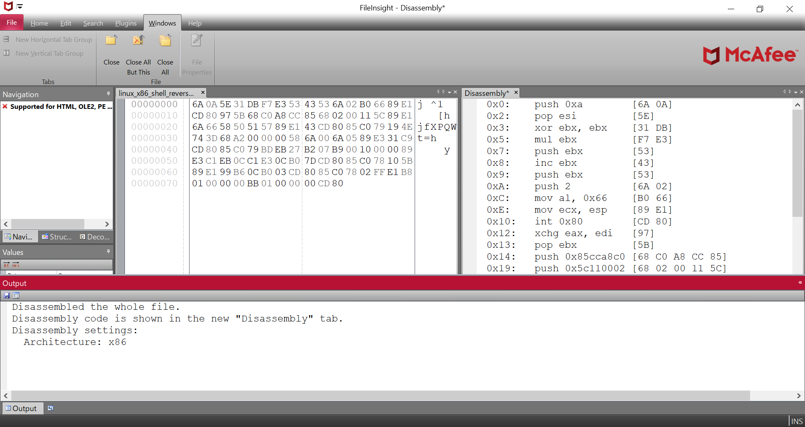
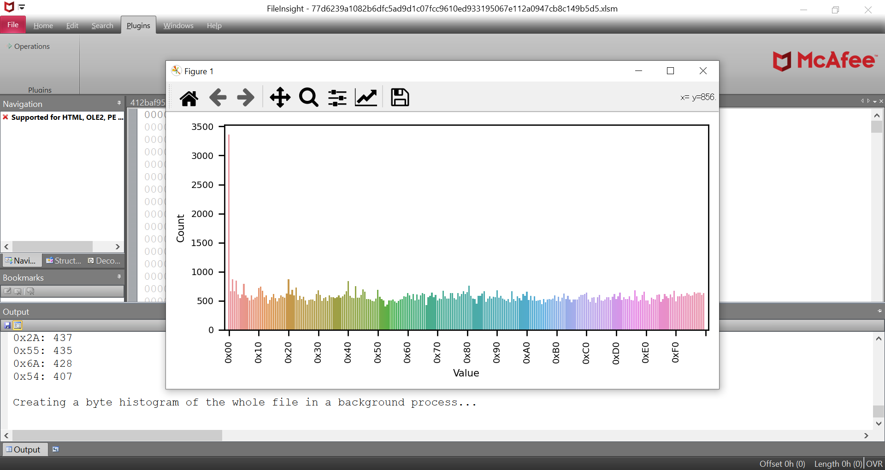

# FileInsight-plugins: a decoding toolbox of McAfee FileInsight hex editor for malware analysis

FileInsight-plugins is a collection of plugins for McAfee FileInsight hex editor.
It adds many capabilities such as decryption, decompression, searching XOR-ed text strings, scanning with a YARA rule, code emulation, disassembly, and more!
It is useful for various kind of decoding tasks in malware analysis (e.g. extracing malware executables and decoy documents from malicious document files).

## Screenshots
#### Dialog of "AES decrypt" plugin


#### Scan result of "YARA scan" plugin


#### Data structure of ELF executable file parsed by "Parse file structure" plugin


#### Emulation trace of ARM64 Linux shellcode emulated by "Emulate code" plugin


#### Disassembly output of x86 Linux shellcode disassembled by "Disassemble" plugin


#### Bitmap representation of Windows executable file visualized by "Bitmap view" plugin


#### Byte histogram of Excel file shown by "Byte histogram" plugin


#### Entropy graph of Windows executable file shown by "Entropy graph" plugin


## How to install
### Automatic installation
Please execute the following command. The latest release version of FileInsight-plugins and all pre-requisites including FileInsight and Python 3 (x64) will be installed.

```
powershell -exec bypass -command "IEX((New-Object Net.WebClient).DownloadString('https://raw.githubusercontent.com/nmantani/FileInsight-plugins/master/install.ps1'))"
```

If you use a HTTP proxy, please download [install.ps1](https://raw.githubusercontent.com/nmantani/FileInsight-plugins/master/install.ps1) and edit $PROXY_HOST and $PROXY_PORT variables in it,
then please execute the following command.

```
powershell -exec bypass .\install.ps1
```

### Manual installation
Please read [INSTALL.md](INSTALL.md) for details.
**I strongly recommend automatic installation** because manual installation requires many steps.

## How to use
Please click "Operations" in the "Plugins" tab then select a plugin.


You can also use plugins from the right-click menu.


Some plugins show an additional dialog for plugin settings at use of them.


## How to update
### Semi-automatic update
If you would like to update FileInsight-plugins to the latest release version,
please execute the following command. Existing files will be overwritten.

```
powershell -exec bypass -command "& ([scriptblock]::Create((New-Object Net.WebClient).DownloadString('https://raw.githubusercontent.com/nmantani/FileInsight-plugins/master/install.ps1'))) -update"
```

If you use a HTTP proxy, please download install.ps1 and edit $PROXY_HOST
and $PROXY_PORT variables in it, then please execute the following command.

```
powershell -exec bypass .\install.ps1 -update
```

### Manual update
Please download the latest release version and copy "plugins" folder into
%USERPROFILE%\Documents\McAfee FileInsight to overwrite with the new version.

## Customization
For the "Send to" plugin, please edit "plugins\Operations\Misc\send_to.json" to run your
favorite programs.

## List of plugins (105 plugins)
### Basic operations
* Copy to new file  
  Copy selected region (the whole file if not selected) to new file
* Cut binary to clipboard  
  Cut binary data of selected region to clipboard as hex-encoded text
* Copy binary to clipboard  
  Copy binary data of selected region to clipboard as hex-encoded text
* Paste binary from clipboard  
  Paste binary data (converted from hex-encoded text) from clipboard
* Delete before  
  Delete all region before current cursor position
* Delete after  
  Delete all region after current cursor position
* Fill  
  Fill selected region with specified hex pattern
* Invert  
  Invert bits of selected region
* Reverse order  
  Reverse order of selected region
* Swap nibbles  
  Swap each pair of nibbles of selected region
* Swap two bytes  
  Swap each pair of bytes of selected region
* To upper case  
  Convert text to upper case of selected region
* To lower case  
  Convert text to lower case of selected region
* Swap case  
  Swap case of selected region

### Compression operations
* aPLib compress  
  Compress selected region with aPLib compression library
* aPLib decompress  
  Decompress selected region with aPLib compression library
* Bzip2 compress  
  Compress selected region with bzip2 algorithm
* Bzip2 decompress  
  Decompress selected region with bzip2 algorithm
* Gzip compress  
  Compress selected region with gzip format
* Gzip decompress  
  Decompress selected gzip compressed region
* LZ4 compress  
  Compress selected region with LZ4 algorithm
* LZ4 decompress  
  Decompress selected region with LZ4 algorithm
* LZMA compress  
  Compress selected region with LZMA algorithm
* LZMA decompress  
  Decompress selected region with LZMA algorithm
* LZNT1 compress  
  Compress selected region with LZNT1 algorithm
* LZNT1 decompress  
  Decompress selected region with LZNT1 algorithm
* LZO compress  
  Compress selected region with LZO algorithm
* LZO decompress  
  Decompress selected region with LZO algorithm
* PPMd compress  
  Compress selected region with PPMd algorithm
* PPMd decompress  
  Decompress selected region with PPMd algorithm
* QuickLZ compress  
  Compress selected region with QuickLZ compression library
* QuickLZ decompress  
  Decompress selected region with QuickLZ compression library
* Raw deflate  
  Compress selected region with Deflate algorithm without header and checksum (equivalent to gzdeflate() in PHP language)
* Raw inflate  
  Decompress selected Deflate compressed region that does not have header and checksum (equivalent to gzinflate() in PHP language)
* XZ compress  
  Compress selected region with XZ format
* XZ decompress  
  Decompress selected XZ compressed region
* zlib compress (deflate)  
  Compress selected region with zlib (Deflate algorithm)
* zlib decompress (inflate)  
  Decompress selected region with zlib (Deflate algorithm)
* Zstandard compress  
  Compress selected region with Zstandard algorithm
* Zstandard decompress  
  Decompress selected region with Zstandard algorithm

### Crypto operations
* AES decrypt  
  Decrypt selected region with AES
* AES encrypt  
  Encrypt selected region with AES
* ARC2 decrypt  
  Decrypt selected region with ARC2 (Alleged RC2)
* ARC2 encrypt  
  Encrypt selected region with ARC2 (Alleged RC2)
* ARC4 decrypt / encrypt  
  Decrypt / encrypt selected region with ARC4 (Alleged RC4)
* Blowfish decrypt  
  Decrypt selected region with Blowfish
* Blowfish encrypt  
  Encrypt selected region with Blowfish
* ChaCha20 decrypt / encrypt  
  Decrypt / encrypt selected region with ChaCha20
* DES decrypt  
  Decrypt selected region with DES
* DES encrypt  
  Encrypt selected region with DES
* Salsa20 decrypt / encrypt  
  Decrypt / encrypt selected region with Salsa20
* TEA decrypt  
  Decrypt selected region with TEA (Tiny Encryption Algorithm)
* TEA encrypt  
  Encrypt selected region with TEA (Tiny Encryption Algorithm)
* Triple DES decrypt  
  Decrypt selected region with Triple DES
* Triple DES encrypt  
  Encrypt selected region with Triple DES
* XTEA decrypt  
  Decrypt selected region with XTEA (eXtended Tiny Encryption Algorithm)
* XTEA encrypt  
  Encrypt selected region with XTEA (eXtended Tiny Encryption Algorithm)

### Encoding operations
* Binary data to hex text  
  Convert binary of selected region into hex text
* Hex text to binary data  
  Convert hex text of selected region into binary
* Binary data to decimal text  
  Convert binary of selected region into decimal text
* Decimal text to binary data  
  Convert decimal text of selected region into binary data
* Binary data to octal text  
  Convert binary of selected region into octal text
* Octal text to binary data  
  Convert octal text of selected region into binary data
* Binary data to binary text  
  Convert binary of selected region into binary text
* Binary text to binary data  
  Convert binary text of selected region into binary data
* Custom base32 decode  
  Decode selected region with custom base32 table
* Custom base32 encode  
  Encode selected region with custom base32 table
* Custom base58 decode  
  Decode selected region with custom base58 table
* Custom base58 encode  
  Encode selected region with custom base58 table
* Custom base64 decode  
  Decode selected region with custom base64 table
* Custom base64 encode  
  Encode selected region with custom base64 table
* Protobuf decode  
  Decode selected region as Protocol Buffers serialized data without .proto files
* ROT13  
  Rotate alphabet characters in selected region by the specified amount (default: 13)
* From quoted printable  
  Decode selected region as quoted printable text
* To quoted printable  
  Encode selected region into quoted printable text
* Unicode escape  
  Escape Unicode characters of selected region
* Unicode unescape  
  Unescape Unicode escape sequence of selected region
* URL decode  
  Decode selected region as percent-encoded text that is used by URL
* URL encode  
  Encode selected region into percent-encoded text that is used by URL

### Misc operations
* Emulate code  
  Emulate selected region as an executable or shellcode with Qiling Framework (the whole file if not selected)
* File comparison  
  Compare contents of two files
* Hash values  
  Calculate MD5, SHA1, SHA256, ssdeep, imphash, impfuzzy hash values of selected region (the whole file if not selected)
* Send to  
  Send selected region (the whole file if not selected) to other programs

### Parsing operations
* Binwalk scan  
  Scan selected region (the whole file if not selected) to find embedded files
* Disassemble  
  Disassemble selected region (the whole file if not selected)
* File type  
  Identify file type of selected region (the whole file if not selected)
* Find PE file  
  Find PE file from selected region (the whole file if not selected)
* Parse file structure  
  Parse file structure of selected region (the whole file if not selected) with Kaitai Struct
* Show metadata  
  Show metadata of selected region (the whole file if not selected) with ExifTool
* Strings  
  Extract text strings from selected region (the whole file if not selected)

### Search operations
* Regex search  
  Search with regular expression in selected region (the whole file if not selected)
* Replace  
  Replace matched data in selected region (the whole file if not selected) with specified data
* XOR hex search  
  Search XORed / bit-rotated data in selected region (the whole file if not selected)
* XOR text search  
  Search XORed / bit-rotated string in selected region (the whole file if not selected)
* YARA scan  
  Scan selected region (the whole file if not selected) with YARA.

### Visualization operations
* Bitmap view  
  Visualize the whole file as bitmap representation
* Byte histogram  
  Show byte histogram of selected region (the whole file if not selected)
* Entropy graph  
  Show entropy graph of selected region\n(the whole file if not selected)

### XOR operations
* Decremental XOR  
  XOR selected region while decrementing XOR key
* Incremental XOR  
  XOR selected region while incrementing XOR key
* Null-preserving XOR  
  XOR selected region while skipping null bytes and XOR key itself
* XOR with next byte  
  XOR selected region while using next byte as XOR key
* Guess multibyte XOR keys  
  Guess multibyte XOR keys from selected region (the whole file if not selected) based on revealed keys that are XORed with 0x00
* Visual encrypt  
  Encode selected region with visual encrypt algorithm that is used by Zeus trojan
* Visual decrypt  
  Decode selected region with visual decrypt algorithm that is used by Zeus trojan

## Author
Nobutaka Mantani (Twitter: @nmantani)

## License
The BSD 2-Clause License (http://opensource.org/licenses/bsd-license.php)
